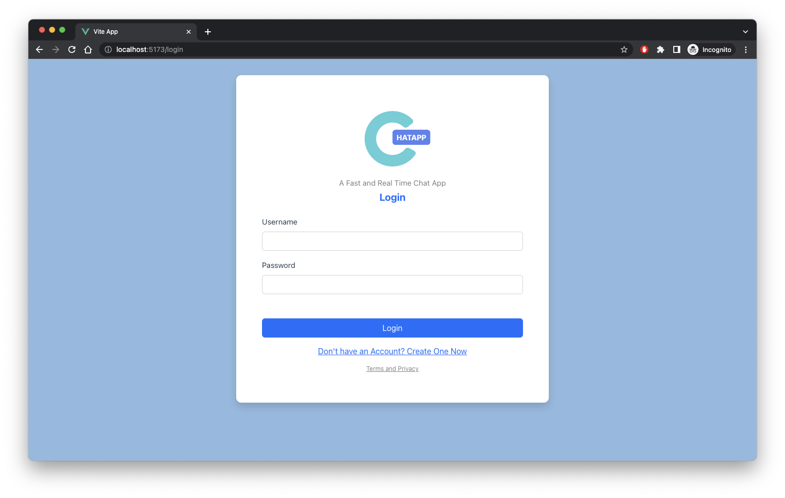
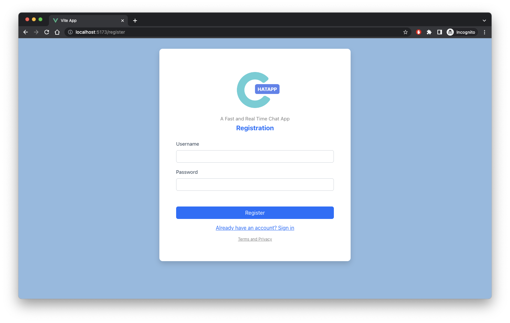
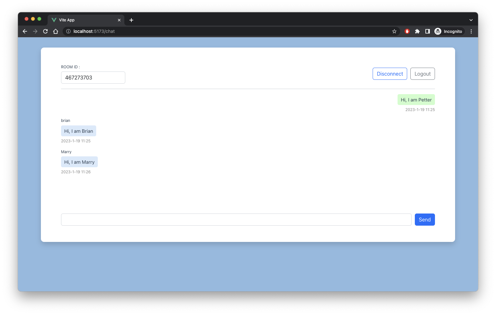

# A Web Socket Chat Application

Before running the frontend code, please go to https://github.com/Briantam0422/chatapp to run backend code first.

## Live Demo
A Demo website : http://chatapp.briantambusiness.com/login

## Frontend

Run the project in the localhost. The port must be 5173.

### Project Setup

```jsx
npm install
```

### **Compile and Hot-Reload for Development**

```jsx
npm run dev
```

## Functions

## Login



## Registration



## Chat Room and Real Time Chat



# ** Instruction **
1. Register an account
2. Login to the account
3. Create a chat room (For room owner)
4. Share room id to your friends / Or open another browsers ( Pretend there are multiple people )
   1. Copy the room id and send to your friends
   2. Paste the room id in the "room_id" input box
   3. Click "Connect" button
5. Join room by id
   1. Paste room id in the “ROOM ID” input
   2. Click connect
   3. Now you can start sending messages with other people in the same room
6. Live chat
   1. real time message
7. Multiple user in a room
   1. A chat room supports multiple user in a room
